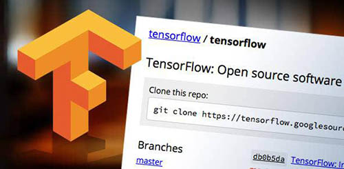
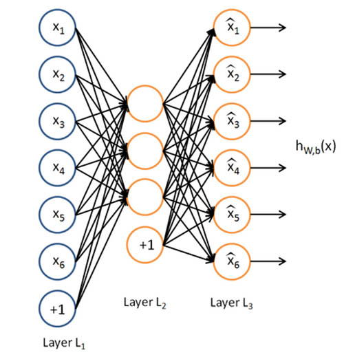
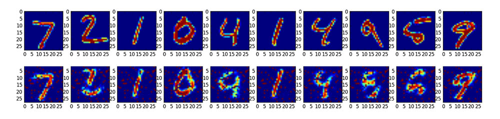
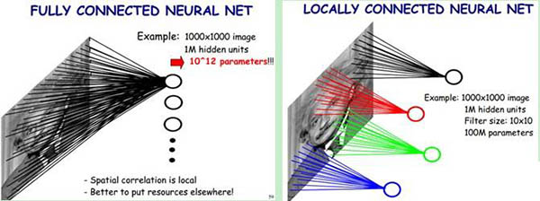
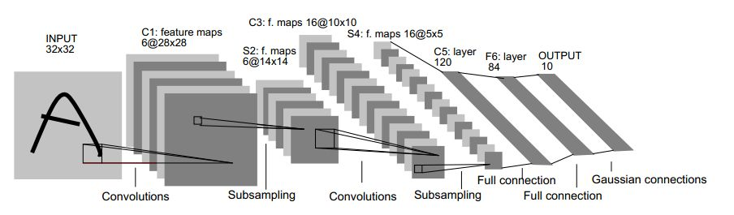
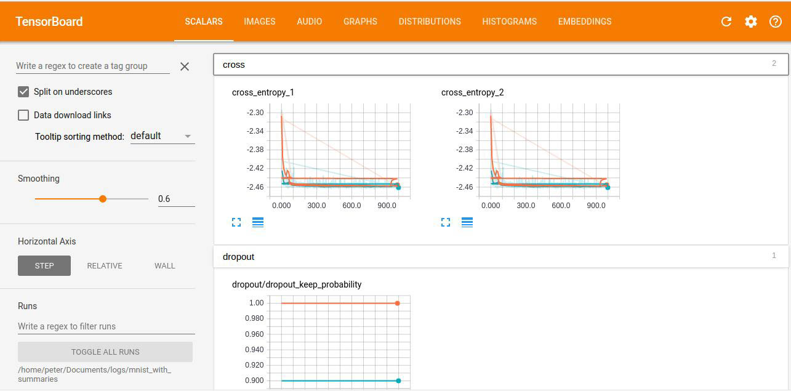
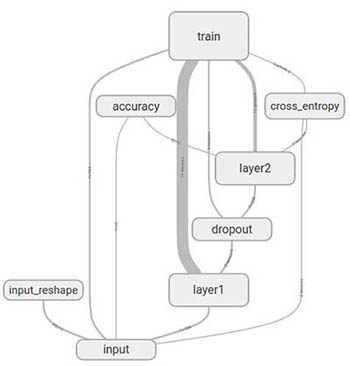
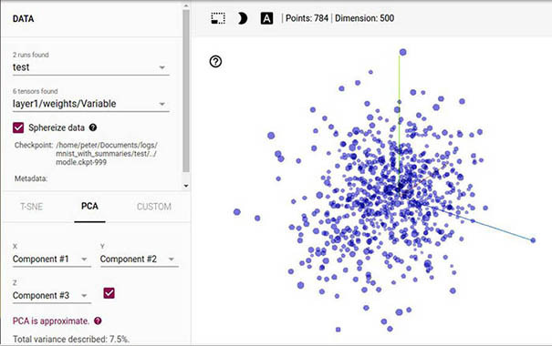

# 写在前面

经过前一两周调试、熟悉深度学习设备，再加上实验室的改造，硬件差不多完事了 
在骆炜和瑞宇相继离开之后，决定由我来搞深度学习，临阵磨刀，肯定先看书啊 
组长买回两本深度学习的典型框架的书，分别是关于TensorFlow 和 Caffe 
本着对Python的不离不弃（其实是不想从头去看C/C++），决定入手TensorFlow 
这本《TensorFlow实战》是2017年2月刚上市的，好评如潮，值得一看 
<!-- more -->

# TensorFlow简介

TensorFlow是由Google公司开发的开源框架，提供实现机器学习算法接口 
TensroFlow是由Google Brain团队基于第一代分布式机器学习框架DistBelief（未开源）上开发的 
2015.11在Github上开源，2016.4补充分布式版本，2017.1发布1.0版本 
TensorFlow官网：www.tensorflow.org 
GitHub: github.com/tensorflow/tensorflow 
模型仓库：github.com/tensorflow/models 
前端支持：Python、C++、Go、Java等 
后端支持：C++、CUDA 
适合众多异构系统：Android、iphone、普通CPU、大规模GPU 
封装算法：深度学习、线性回归、逻辑回归、随机森林 
TensorFlow特点之一是用数据流式图来规划计算流程，即计算图 

# Tensorflow安装

1、安装Anaconda (www.continuum.io/downloads)，内含Python应用程序及大量实用Python库 
2、CPU/GPU版本的TensorFlow库安装，从Python官网https://pypi.python.org/pypi 找对应版本 
3、安装CUDA，从NVIDIA CUDA官网http://developer.nvidia.com/cuda-toolkit 下载 
4、从http://developer.nvidia.com/rdp/cudnn-download 下载cuDNN，解压后有3个文件 
&nbsp;&nbsp;&nbsp;(1) 将cudnn.h放入CUDA的tookit安装目录的include文件夹中 
&nbsp;&nbsp;&nbsp;(2) cudnn.dll放入bin文件夹中 
&nbsp;&nbsp;&nbsp;(3) cudnn.lib放入lib/x64文件夹中 

使用TensorFlow-GPU版本运行的话，如果CUDA文件成功加载的话会有下面的提示：
        
        I c:\tf_jenkins\home\workspace\release-win\device\gpu\os\windows\tensorflow\stre
        am_executor\dso_loader.cc:135] successfully opened CUDA library cublas64_80.dll locally
        I c:\tf_jenkins\home\workspace\release-win\device\gpu\os\windows\tensorflow\stre
        am_executor\dso_loader.cc:135] successfully opened CUDA library cudnn64_5.dll locally
        I c:\tf_jenkins\home\workspace\release-win\device\gpu\os\windows\tensorflow\stre
        am_executor\dso_loader.cc:135] successfully opened CUDA library cufft64_80.dll locally
        I c:\tf_jenkins\home\workspace\release-win\device\gpu\os\windows\tensorflow\stre
        am_executor\dso_loader.cc:135] successfully opened CUDA library nvcuda.dll locally
        I c:\tf_jenkins\home\workspace\release-win\device\gpu\os\windows\tensorflow\stre
        am_executor\dso_loader.cc:135] successfully opened CUDA library curand64_80.dll locally
        ...
还有设备显卡信息，目前GPU计算大多要求CUDA计算能力在3.0以上，像一般PC上的渣渣显卡，就会报这样的错误（心酸） 
然后，程序就会切换到CPU里计算 

        name: NVS 315
        major: 2 minor: 1 memoryClockRate (GHz) 1.046
        pciBusID 0000:03:00.0
        Total memory: 1.00GiB
        Free memory: 591.15MiB
        I c:\tf_jenkins\home\workspace\release-win\device\gpu\os\windows\tensorflow\core\common_untime\gpu\gpu_device.cc:906] DMA: 0
        I c:\tf_jenkins\home\workspace\release-win\device\gpu\os\windows\tensorflow\core\common_untime\gpu\gpu_device.cc:916] 0:   Y
        I c:\tf_jenkins\home\workspace\release-win\device\gpu\os\windows\tensorflow\core\common_untime\gpu\gpu_device.cc:948] Ignoring visible gpu device (device: 0, name: NVS 315, pci bus id: 0000:03:00.0) with Cuda compute capability 2.1. The minimum required Cuda capability is 3.0.
        ...

# TensorFlow实例

1. **Softmax Regrssion** 

使用手写数字数据库（MNIST：Mixed National Institute of standards and Technology database） 
Softmax Regrssion实际上是感知器模型，线性分类器，对手写数字的分类效果精度大约在**92%** 
（具体程序参见https://github.com/peter-cai/TensorFlowInAction ，下同） 

2. **AutoEncoder**

图像分类重要概念之一是稀疏编码，对于16px\*16px的图片，几乎所有图像碎片都可以用64种正交边组合 
这些组合的正交边可称为basis，通过不同的方式可以组合成不同的高阶特征，如人脸、汽车等等 
由basis可以组合器官再组合成人脸，可以组合成零部件再组合成汽车 
AutoEncoder，即自编码器，期望输入和输出是一致的，目标是用稀疏的高阶特征来重构自己 
AutoEncoder为了有效提取特征信息，可以加入限制：控制隐层节点数量、权重L1正则化、给数据加噪 
2007年，Hinton在Science上发表了关于Deep Belief Network（DBN，深度置信网络）有效解决“梯度弥散”问题 
DBN包含三个步骤：AutoEncoder的无监督训练；提取特征并初始化权重；用标注数据进行监督训练。 

&nbsp;&nbsp;&nbsp;&nbsp;&nbsp;&nbsp;&nbsp;&nbsp;&nbsp;**AutoEncoder模型结构**

&nbsp;&nbsp;&nbsp;&nbsp;&nbsp;&nbsp;&nbsp;&nbsp;&nbsp;**手写数字图像重构训练数据和输出结果*

3. **Multi-layer Perceptron**

Multi-layer Perceptron（MLP，多层感知器）也就是Back Propagation，是神经网络中应用最广泛的算法之一 
MLP采用误差反向传播来反馈调整连接权值，权重采用梯度下降法调整 
MLP常采用Sigmoi函数作为激励，使模型具有非线性映射能力，但层数多会出现“梯度弥散”现象 
ReLU函数是最近使用广泛的函数，特点：单侧抑制、相对宽阔便捷、稀疏激活性、反向传播不会出现“梯度弥散”现象 
MLP、CNN隐层可以使用ReLU，输出层用Sigmoid函数（接近概率输出分布），而RNN常用sigmoid和tanh函数 
理论上，隐层节点数足够多的MLP模型可以拟合任意非线性函数，且所需隐层总节点数随隐层增多而指数下降 
在MNIST数据分类实验中，MLP精度在98%左右 

4. **Convolutional Nerual Network**

Convolutional Nerual Network（CNN，卷积神经网络）是当前图像处理领域最受欢迎的算法之一 
（RNN用于自然语言处理，Word2Vec用于将自此转哈uwei计算机可理解的稠密向量Dense Vector） 
CNN基本思想源于1960年代提出的感受野（Receptive Field）理论，认为每一个视觉神经元只会处理一小块区域的视觉图像 
图像在空间上是有组织结构的，每一个像素和周围的像素点实际上是有紧密联系的 
CNN首个成功的多层训练网络结构是LeCun的LeNet5 
CNN优点：降低数据预处理要求；对图像的缩放、平移、旋转等畸变具有不变性；卷积权值共享、减少参数、降低复杂度 
CNN要点：局部连接（local connectivity）+权值共享（weight sharing）+池化（pooling）+降采样（down-sampling） 
CNN有更优秀的网络设计，即卷积网络对图像特征的提取和抽象能力；权值共享大大减少了参数数量，降低计算量，减轻过拟合 
卷积层：特征选取，参数少；全连接层：分类预测，参数多 
CNN的发展现在有两个方向：网络结构优化和网络深度增加 
在MNIST数据分类实验中，CNN精度在99.2%左右 

&nbsp;&nbsp;&nbsp;&nbsp;&nbsp;&nbsp;&nbsp;&nbsp;&nbsp;**全连接（左）与局部连接（右）**

&nbsp;&nbsp;&nbsp;&nbsp;&nbsp;&nbsp;&nbsp;&nbsp;&nbsp;**LeNet5结构示意图**

5. **TensorBoard**

TensorBoard是TensorFlow官方推出的可视化工具，展示模型训练过程的汇总数据（标量/图片/音频/计算图/数据分布/直方图/嵌入向量） 
TensorBoard是将计算过程中的数据汇总记录在日志文件中，然后解析数据生产可视化的web界面（目前仅支持Linux系统的Chrome） 

 
&nbsp;&nbsp;&nbsp;&nbsp;&nbsp;&nbsp;&nbsp;&nbsp;&nbsp;**TensorBoard界面** 
  
 &nbsp;&nbsp;&nbsp;&nbsp;&nbsp;&nbsp;&nbsp;&nbsp;&nbsp;**计算图**  

  
&nbsp;&nbsp;&nbsp;&nbsp;&nbsp;&nbsp;&nbsp;&nbsp;&nbsp;**数据可视化** 

