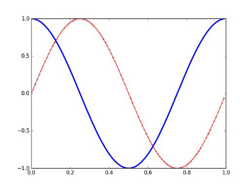
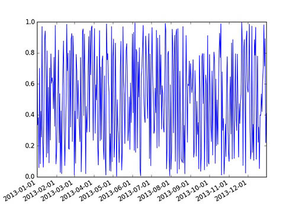
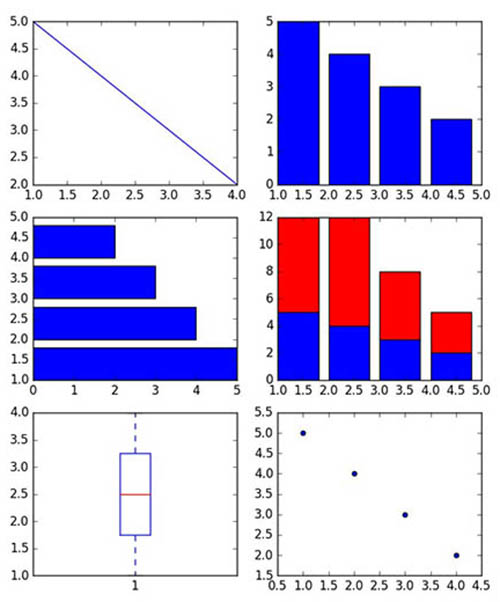
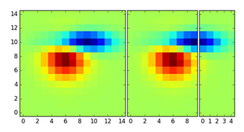
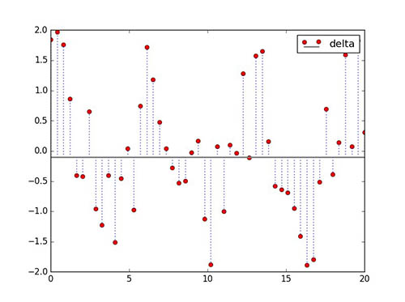

>可视化路漫漫，一步一个脚印往前走！

# 写在前面
最近一直在可视化的道路上不断前行，看书+码代码<br>
一开始是看浙大陈为他们写的《数据可视化》，了解可视化的一些基本知识<br>
然后是看可视化工具，Python可视化只是其中之一<br>
本文是基于[《Python数据可视化编程实战》](https://book.douban.com/subject/26378430/)内容总结的<br>
主要是关于Python可视化入门的基础内容，更多是以例子和程序来总结<br>
<!-- more -->

# S1  环境设置
需要安装库：matplotlib、Numpy、Scipy、PIL、Requests
可使用预打包环境：EPD、Anaconda、Python(x,y)
```python
import matplotlib.pyplot as plt  
import numpy as np  
t = np.arange(0.0, 1.0, 0.01)  
s = np.sin(2 * np.pi * t)  
#设置线宽、线性和颜色   
plt.plot(t,s,color = 'r',marker = "+",linewidth=1)    
c = np.cos(2 * np.pi * t)  
plt.rcParams['lines.linewidth'] = 3  
#plt.rcdefaults()  -- set defaults  
plt.plot(t,c)  
plt.show() 
```


# S2 读取CSV文件

常规做法：
```python
import csv
with open(filename,'r',encoding = 'utf-8') as f:  
    reader = csv.reader(f)  
    header = reader.__next__()#python 3.x要用__next__()  
    data = [row for row in reader]  
```
数据量大：
```python
data = numpy.loadtxt('ch02-data.csv',dtype='|S',delimiter=',')  
for datarow in data:  
    print(datarow)  
```
# S3 读取Excel文件

```python
import xlrd  
filename = 'ch02-data.xlsx'  
wb = xlrd.open_workbook(filename = filename)  
ws = wb.sheet_by_name('Sheet1')  
dataset = []  
for r in range(ws.nrows):  
    col = []  
    for c in range(ws.ncols):  
        col.append(ws.cell(r,c).value)  
    dataset.append(col)  
1from pprint import pprint  
1pprint(dataset)  
```
# S4 时间序列绘制

```python
from pylab import *  
import matplotlib as matplotlib  
import datetime  
fig = figure()  
ax = gca()  # get current axis  
start = datetime.datetime(2013, 1, 1)  # set some daterange  
stop = datetime.datetime(2013, 12, 31)  
delta = datetime.timedelta(days = 1)   
dates = mpl.dates.drange(start, stop, delta)  # convert dates for matplotlib 
values = np.random.rand(len(dates))  # generate some random values  
ax = gca()    
ax.plot_date(dates, values, linestyle = '-', marker='')  # create plot with dates  
date_format = mpl.dates.DateFormatter('%Y-%m-%d')  #specify formater   
ax.xaxis.set_major_formatter(date_format)  # apply formater 
# autoformat data labels  
# rotates labels by 30 degrees by default  
# use rotate param to specify different rotation degree  
# use bottom param to give more room to date labels  
fig.autofmt_xdate()  
show()
```


# S5 常规图表、多图排列绘制

```python
from matplotlib.pyplot import *  
x = [1,2,3,4]  # some simple data  
y = [5,4,3,2]  
figure()  # create new figure  
subplot(321)  # divide subplots into 3×2 grid and select #1  
plot(x, y)  
subplot(322)  #select #2  
bar(x, y) 
subplot(323)   # horizontal bar-charts  
barh(x, y)  
subplot(324)  
bar(x, y)  # create stacked bar bar-charts 
y1 = [7,8,5,3]  
bar(x, y1, bottom = y, color = 'r')   # stacked bar bar-charts  
subplot(325)  
boxplot(x)  # box plot  
subplot(326)  
scatter(x, y)  # scatter plot  
show()  
```


# S6 热力图绘制

```python
import numpy as np  
import matplotlib.pyplot as plt  
from mpl_toolkits.axes_grid1 import ImageGrid  
from matplotlib.cbook import get_sample_data  
def get_demo_image():  
    f = get_sample_data("axes_grid/bivariate_normal.npy", asfileobj = False)  
    # z is a numpy array of 15×15  
    Z = np.load(f)  
    return Z, (-3, 4, -4, 3)  
def get_grid(fig=None, layout=None, nrows_ncols=None):  
    assert fig is not None  
    assert layout is not None  
    assert nrows_ncols is not None  
    grid = ImageGrid(fig, layout, nrows_ncols = nrows_ncols, axes_pad=0.05, add_all=True, label_mode='L')  
    return grid  
def load_images_to_grid(grid, Z, *images):  
    min, max = Z.min(), Z.max()  
    for i, image in enumerate(images):  
        axes = grid[i]  
        axes.imshow(image, origin = 'lower',vmin = min, vmax = max, interpolation = 'nearest')  
if __name__ == '__main__':  
    fig = plt.figure(1, (8, 6))  
    grid = get_grid(fig, 111, (1,3))  
    Z, extent = get_demo_image()  
    # Slice image  
    image1 = Z  
    image2 = Z[:, :10]  
    image3 = Z[:, 10:]  
    load_images_to_grid(grid, Z, image1, image2, image3)  
    plt.draw()  
    plt.show()  
```


# S7  用PIL做图像处理

（1）PIL坐标系统原点（0，0）位于左上角；<br>
（2）im=Image.open(filename)：打开一个文件，并把图像加载在im对象上；<br>
（3）im.crop(box)：裁剪左、上、右、下像素内图像，box=(0, 100, 100, 100)；<br>
（4）im.filter(filter)：图像滤波；<br>
（5）im.histogram()：图像像素值直方图列表，单通道256个，双通道768个；<br>
（6）im.resize(size, filter)：重新调整图像大小，并且使用滤波器重新采样，滤波器可选NEAREST、BILINEAR、BICUBIC和ANTIALIAS，默认值为NEAREST。<br>
（7）im.rotate(angle, filter)：逆时针方向旋转图像；<br>
（8）im.split()：分离图像波段，可用于分离RGB图像为3个单独波段；<br>
（9）ImageChops.duplicate(image)：拷贝图像；<br>
（10）ImageChops.invert(image)：反转图像；<br>
（11）ImageChops.difference(image1, image2)：验证图像是否相同；<br>

# S8 火柴杆图绘制

```python
import matplotlib.pyplot as plt  
import numpy as np  
# time domain  
x = np.linspace(0, 20, 50)  
# random function to simulate sampled signal  
y = np.sin(x+1)+np.cos(x**2)  
# here we can setup baseline position  
bottom = -0.1  
# True -- hold current axes for further plotting  
# False -- clear and use new figure/plot  
hold = False  
# set label for legend   
label = "delta"  
markerline, stemlines, baseline = plt.stem(x,y,bottom=bottom,  
                                      label=label,hold=hold)   
# we use setp() here to setup  
# multiple properties of lines generated by stem()  
plt.setp(markerline, color = 'red', marker = 'o')  
plt.setp(stemlines, color = 'blue', linestyle = ':')  
plt.setp(baseline, color = 'grey', linewidth =2, linestyle = '-')  
# draw a legend  
plt.legend()  
plt.show()  
```


# 结语

本文主要是关于Python常规作图的总结，主要用到的是matplotlib库<br>
Python可视化绘图虽然没有达到R语言的那种认可度，但个人认为还是略胜于matlab的<br>
在之后的学术研究、实践应用，可以考虑选择Python进行绘图<br>
