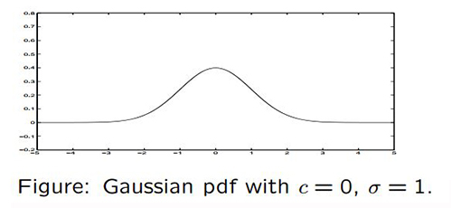
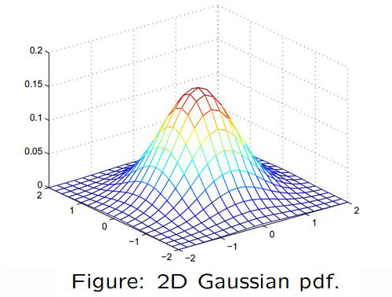
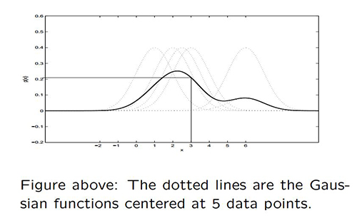
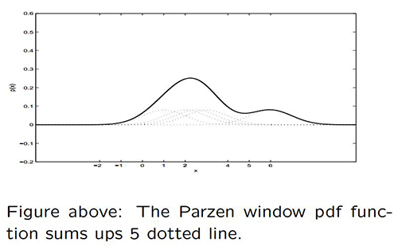

>kernel density estimation是在概率论中用来估计未知的密度函数，属于非参数检验方法之一，由Rosenblatt (1955)和Emanuel Parzen(1962)提出，又名Parzen窗（Parzen window） 
本文翻译自英国雷丁大学（Reading University）Xia Hong老师的[讲义材料](http://www.personal.rdg.ac.uk/~sis01xh/teaching/CY2D2/Pattern2.pdf) 

<!-- more -->

# 概率密度函数

连续概率函数$p(x)$的数学定义满足以下特性： 
1. $x$介于$a$、$b$两点之间的概率为$P(a<x<b)=\int_a^bp(x)dx$ 
2. x是非负实数 
3. 概率函数的积分：$\int_{-\infty}^\infty p(x)dx=1$ 

最常见的概率函数是高斯函数（Gaussian Function，又称为正态分布）：$p(x)=\frac{1}{\sqrt{2\pi\sigma}}\exp(-\frac{(x-c)^2}{2\sigma^2})$，这里$c$是均值，$\sigma$是标准差 

 

拓展到对于向量$\mathbf{x}$，非负函数$p(\mathbf{x})$有以下特性： 
1. $\mathbf{x}$在区域$R$里的概率为$P=\int_R p(\mathbf{x})d\mathbf{x}$ 
2. 概率函数的积分为$\int p(\mathbf{x})d\mathbf{x}=1$ 

# 密度估计

密度估计：给定的一系列数量为$n$的样本$\mathbf{x}_1, \cdot\cdot\cdot,\mathbf{x}_n$，可以估计密度函数$p(\mathbf{x})$，从而根据任意新样本$\mathbf{x}$可以得到输出$p(\mathbf{x})$ 
大部分未知密度函数估计方法的基本思想都很简单，主要是依赖于样本落在区域$R$的概率$P$，即有$P=\int_R p(\mathbf{x})d\mathbf{x}$ 
假设区域$R$很小，$P(\mathbf{x})$在区域内波动很小，上式可以写做$P=\int_R p(\mathbf{x})d\mathbf{x}\approx p(\mathbf{x})\int_R d\mathbf{x}=p(\mathbf{x})V$，这里$V$是区域$R$的“量”（二维即为面积） 
从另一方面看，假设$n$个样本$\mathbf{x}_1, \cdot\cdot\cdot,\mathbf{x}_n$都是独立且服从概率密度函数$p(\mathbf{x})$，且$n$个样本中有$k$个落在区域$R$里面，则有$P=k/n$，因此$p(\mathbf{x})$的估计式为$p(\mathbf{x})=\frac{k/n}{V}$ 

# Parzen窗密度估计

考虑$R$是中心在$\mathbf{x}$的超立方体（例如二维平面），令$h$为超立方体的边缘长度，所以对于二维平面有有$V=h^2$，对于三维立体有$V=h^3$ 

 

引入$\phi(\frac{\mathbf{x}_i-\mathbf{x}}{h})=\left\{
\begin{aligned}
1\quad& \frac{|x_{ik}-x_{k}|}{h}<=1/2, k=1,2 \\
0\quad& otherwise
\end{aligned}
\right.$ 
Parzen概率密度公式（二维）为$p(\mathbf{x})=\frac{k/n}{V}=\frac{1}{n}\sum_{i=1}^n {\frac{1}{h^2}\phi(\frac{\mathbf{x}_i-\mathbf{x}}{h})}$，$\phi(\frac{\mathbf{x}_i-\mathbf{x}}{h})$即为窗函数 
我们归纳这个思想并拓展到其他Parzen窗密度估计法中 
例如，如果使用高斯函数，对于一维有：$p(x)=\frac{1}{n}\sum_{i=1}^{n}{\frac{1}{\sqrt{2\pi\sigma}}\exp(-\frac{(x_i-x)^2}{2\sigma^2})}$，这是对$n$个将数据点作为中心的高斯函数的简单求平均，公式中的$\sigma$需要再做确定 

----
**例子**：
给定一个系列的5个数据点$x_1=2$，$x_2=2.5$，$x_3=3$，$x_4=1$，$x_5=6$，参数$\sigma=1$，中心$x=3$的高斯函数作为窗函数，求出Parzen概率密度估计（pdf）
**解答**：
$\frac{1}{\sqrt{2\pi}}\exp(-\frac{(x_1-x)^2}{2})=\frac{1}{\sqrt{2\pi}}\exp(-\frac{(2-3)^2}{2})=0.2420$
$\frac{1}{\sqrt{2\pi}}\exp(-\frac{(x_2-x)^2}{2})=\frac{1}{\sqrt{2\pi}}\exp(-\frac{(2.5-3)^2}{2})=0.3521$
$\frac{1}{\sqrt{2\pi}}\exp(-\frac{(x_3-x)^2}{2})=\frac{1}{\sqrt{2\pi}}\exp(-\frac{(3-3)^2}{2})=0.3989$
$\frac{1}{\sqrt{2\pi}}\exp(-\frac{(x_4-x)^2}{2})=\frac{1}{\sqrt{2\pi}}\exp(-\frac{(1-3)^2}{2})=0.0540$
$\frac{1}{\sqrt{2\pi}}\exp(-\frac{(x_5-x)^2}{2})=\frac{1}{\sqrt{2\pi}}\exp(-\frac{(6-3)^2}{2})=0.0044$
因此，$p(x=3)=(0.2420 + 0.3521 + 0.3989+0.0540 + 0.0044)/5 = 0.2103$

----
下面用图形化语言表示Parzen窗，每个数据点密度函数（虚线）对于最终的概率密度函数（实线）有相同的贡献度

