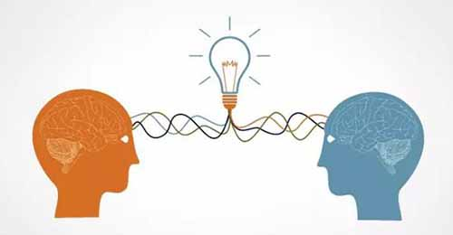
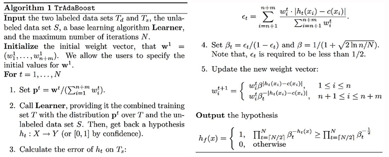
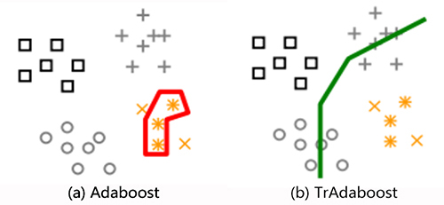
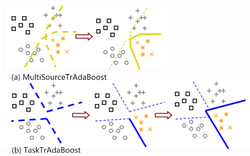
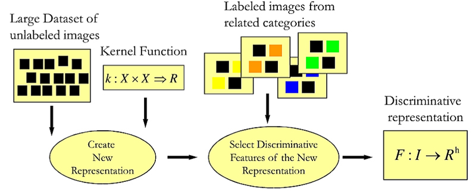
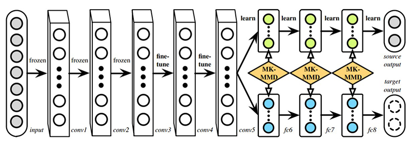
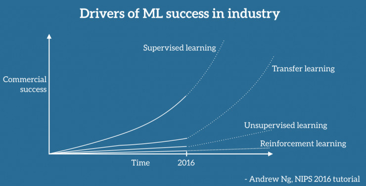

# 1  迁移学习概念

* 机器学习和数据挖掘的基本假设
  * （1）用于学习的训练样本与新的测试样本满足独立同分布的条件
  * （2）必须有足够多的训练样本才能学习得到一个好的分类模型
* 然而，由于系统的特征往往会随时间改变，因此数据的特征空间和分布规律也会发生变化
* 如果每次针对新问题都需要对数据做标签的任务，代价是十分高昂的，因此，迁移学习的目的在于应用过去的知识来快速有效解决新问题。
<!-- more --> 

* 迁移学习可应用与分类、回归和聚类问题
* 迁移学习与domain adaptation、multitask learning and sample selection bias、as co-variate shift等机器学习技术密切关联
* 迁移学习最早是关注对过去知识的保留和重用（retain and reuse previously learned knowledge，NIPS-95 workshop on “Learning to Learn”）
* 典型例子：网络文本分类、室内Wifi定位、产品效用评价
* 迁移学习相关术语：learning to learn, life-long learning, knowledge transfer, inductive transfer, multi-task learning, knowledge consolidation, context sensitive learning, knowledge-based inductive bias, meta learning, and incremental/cumulative learning
* 类似技术：多任务学习框架（multi-task learning framework），即基于潜在的相同特征，同时对多个不同任务进行学习

* 迁移学习分为[^1]：：归纳式迁移学习（inductive transfer learning）， 直推式迁移学习（transductive transfer learning）和无监督迁移学习（unsupervised transfer learning）
* 归纳式和无监督迁移学习的源任务和目标任务虽然不同但相关
* 直推式迁移学习的源任务和目标任务则是相同的，但源域和目标域不同但相关
* 三类问题的显著区别还体现在源域和目标域有无标签，具体如下：

| 迁移学习问题分类|源域标签|目标域标签|任务      |相关领域|
| :-------------: |:------:|:--------:|:--------:|:--:|
| 归纳式迁移学习  | 有/无  | 有       |回归、分类|多任务学习/自主学习|
| 直推式迁移学习  | 有     | 无       |回归、分类|域适应性、样本选择偏差、covariate shift|
| 无监督迁移学习  | 无     | 无       |聚类、降维| - |

|迁移学习技巧|描述|
|:--:|:--:|
|基于实例迁移|将原问题域的标签数据重新设置权重用于目标问题|
|特征表达迁移|寻找合适的特征表达减少原问题和目标问题的域偏差|
|参数迁移|原问题和目标问题共享参数|
|相关知识迁移|建立原问题和目标问题的相关知识映射|

* 迁移学习需要重点关注问题是：如何避免negative transfer，需要深入探讨定义原问题和目标问题的相似性和可迁移性
* 为提高泛化能力，通常假设原问题的域和目标问题的域具有相同的特征空间，但具体应用场合往往是不同的，即需要采用异质迁移方法
* 迁移学习技术应用与传感器网络定位、文本分类和图像识别，未来可拓展至视频分类、社交网络分析和逻辑推断

# 2  归纳式迁移学习：TrAdaBoost及其衍生算法

* TrAdaBoost[^2]是基于实例迁移方法的一种，是AdaBoost法(Freund & Schapire, 1997)的扩展。TrAdaBoost在大量原有数据的基础上利用少量的新标签数据来获得对于新数据的高质量的分类模型。用boosting的方法找出原有数据与新标签数据的异同部分，设置训练实例的权重
* 训练标签数据分为同分布（针对于新问题）和不同分布（针对于老问题），数据的权重初始化是一样的，训练得到分类器。如果某个同分布实例预测错误，与Adaboost一样，则加大该实例权重，但如果是不同分布的实例预测错误，则认为该数据不符合新问题，减小权重
* 具体的流程为：

* 算法迭代5流程即为权重调整策略
* TrAdaBoost法收敛率基于Boosting法，为$O\sqrt{n\log n}$，其应用场合在于新问题的标签数据较少的情形
* 如果新问题的标签数据足够大，可以单独训练出一个强分类器，那么TaAdaBoost方法的效果不会提升，反而可能变差
* AdaBoost算法随着迭代步骤增加，预测出错样本权重变得很大，可能出现过拟合

* TrAdaBoost是在AdaBoost算法基础上引入的迁移学习的思想，应对源域标签数据量大，而目标域标签数据量小情况下可以取得不错的效果
* 但是当源域数据含有较多分布的时候，效果不好
* 下图分别是boosting和TrAdaBoost算法的分类面示意图

* 应对多源数据，Yao等人提出了两种TrAdaBoost的衍生算法[^3]，MultiSourceTrAdaBoost和TaskTrAdaBoost
* MultiSourceTrAdaBoost是将同分布的源域分别和目标域训练模型，再将多个分类器结合
* TaskTrAdaBoost首先是只用源域数据分别训练模型，然后引入目标域数据加权综合分类器，这是基于参数迁移的方法

# 3  归纳式迁移学习：基于特征的迁移学习

* 归纳式迁移学习是应用域大量源域未标签数据和少量目标域标签数据的场合
* Quatton等人[^4]提出稀疏原型表示法基本思想是用未标签数据获取特征矩阵，用标签数据训练特征矩阵维度系数
* 该方法类似于稀疏编码，主要应用于图像中
* 如果有少量的属于某个topic 的图片和大量未标签的图片，可以用未标签图片构建特征空间，然后用标签数据选择合适的特征空间
* 方法的优点是适用性强，缺点是优化问题求解困难，且容易过度适配

# 4  直推式迁移学习：基于特征的迁移学习

* 直推式迁移学习是应用于源域标签数据和目标域未标签数据的场合
* 用标签数据来标定未标签数据，但不能直接用，需要进行转换，例如文本分类
* Pan等人提出了维度约减的方法[^5]，基本思想是：
  * （1）将标签和未标签数据的输入映射到低维空间，再用合适核映射使得俩数据集尽可能相似 
  * （2）用上述映射得到的标签数据输入和对应输出训练得到分类器，然后对未标签数据进行分类
  * （3）对新的未标签数据，应用harmonic function（未标签数据由近邻标签数据加权平均）

* Long等人提出深度适应网络的方法[^6]
* 将CNN（AlexNet）中与学习任务相关的隐藏层映射到再生核希尔伯特空间中
* 通过多核优化的方法（MK-MMD）最小化不同域之间的距离

 
# 5  无监督迁移学习：自学习聚类

* 无监督迁移学习是应用域少量未标签数据的情况
* 如果数据量大可以使用传统方法，但数据量小传统方法效果不好
* Dai等人提出自学习聚类法[^7]，基本思想是构建共同特征空间Z，同时目标数据X和辅助数据Y（大量）聚类  
* 目标函数根据互信息理论定义的，而可将其转化为KL散度的表达式

# 6  总结

* 迁移学习的适用性：
  * （1）问题之间需要有共同要素，具有相似的分布规律、可提取共同的特征等
  * （2）知识的概括度要高，对问题进行抽象，概括本质属性，舍弃偶然属性

* 迁移学习的未来研究方向：
  * （1）域相似性及共同特征，现有VC维、散度等理论还不成熟——研究合适度量方法
  * （2）目前还是以分类回归居多——研究更广泛的应用领域
  * （3）目前相关理论较多，缺乏统一理论——研究统一的迁移学习理论

* 最后是一张2016年Andrew Ng在NIPS会上报告关于机器学习发展趋势的论断
* 监督学习一直是机器学习的主导，过去，现在，未来一直是
* 但是迁移学习、强化学习等新兴学习问题会在未来机器学习领域作用也会越来越大

# 参考文献
* [^1]:[Pan S J, Yang Q. A Survey on Transfer Learning. IEEE Transactions on Knowledge & Data Engineering, 2010, 22(10):1345-1359.](http://www.cogsys.wiai.uni-bamberg.de/teaching/ss12/sem_m2/ASurveyonTransferLearning.pdf)
* [^2]:[W Dai, Q Yang, GR Xue, Y Yu. Boosting for transfer learning. International Conference on Machine Learning, 2007, 238 (6) :193-2000.](http://kowon.dongseo.ac.kr/~dkkang/ML2008Spring/Dai2007.pdf)
* [^3]:[Yao Y, Doretto G. Boosting for transfer learning with multiple sources. IEEE Conference on CVPR, 2010:1855-1862.](http://vision.csee.wvu.edu/~doretto/publications/yaoD10cvpr.pdf)
* [^4]:[Quattoni A, Collins M, Darrell T. Transfer Learning for Image Classification with Sparse Prototype Representations. 2008:1-8.](http://www.cs.columbia.edu/~mcollins/papers/CVPR_2008.pdf)
* [^5]:[Pan S J, Kwok J T, Yang Q. Transfer learning via dimensionality reduction. AAAI Conference on Artificial Intelligence, 2008:677-682.](http://www.cse.ust.hk/~qyang/Docs/2008/AAAIsinnoA.pdf)
* [^6]:[Long M, Cao Y, Wang J, et al. Learning Transferable Features with Deep Adaptation Networks. Computer Science, 2015:97-105.](http://proceedings.mlr.press/v37/long15.pdf)
* [^7]:[Dai W, Yang Q, Xue G R, et al. Self-taught clustering. International Conference. DBLP, 2008:200-207.](http://machinelearning.org/archive/icml2008/papers/432.pdf)
