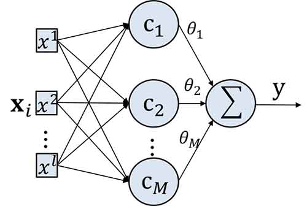
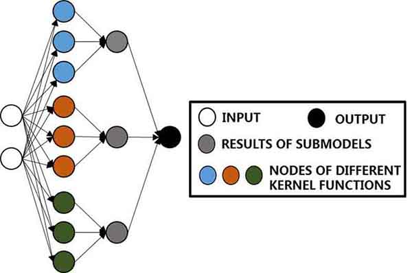
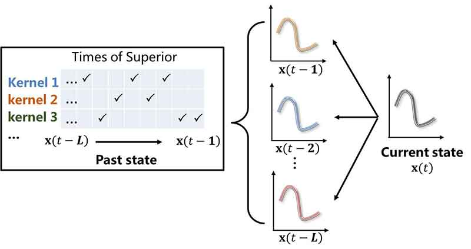
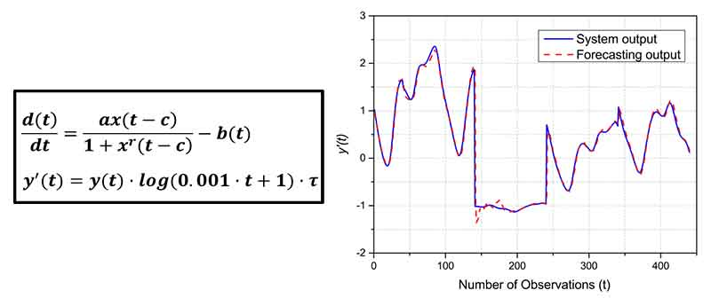
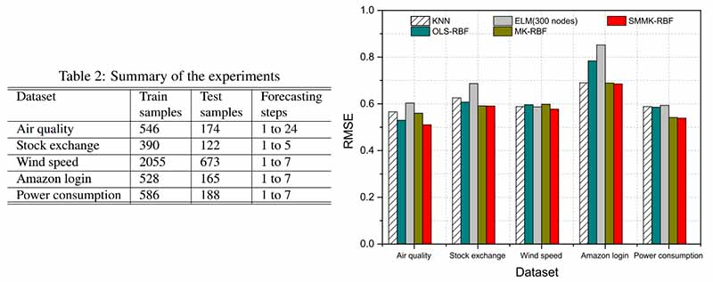

>本文是我参加2017年DDCLS（数据驱动控制、学习和系统）会议汇报内容整理而来，详细内容请参看发表的会议论文“An Adaptive Multi-Kernel RBF Model Using State Matching”

# 1 背景

*  众所周知，系统辨识问题存在于很多领域，例如金融领域中研究股票的走势，气象领域中预测降雨可能性，交通运输领域中预测道路拥堵
<!-- more -->

*  然而，用过去研究的方法仍然有很多问题难以解决
*  现实的系统几乎都是非线性和时变的，采用带有固定结构和参数的静态模型往往难以求解
*  为了应对这样的问题，我们可以采用结构可变的模型或者直接采用组合模型，这里我们选择后者

# 2 RBF神经网络

*  下图是典型的RBF神经网络结构
*  RBF的全称是Radial Biasi Function（径向基函数），它可以完成输入层和隐层之间的高维映射
*  正交最小二乘可以简称为OLS，采用OLS和前进法相结合，可以获得稀疏的模型结构，且能减少复杂计算量
*  在隐层和输出层之间的参数确定采用广义逆的方法。

 
# 3  多核模型

*  在RBF模型的基础上，针对时变系统问题，我们提出了基于状态匹配算法的多核RBF模型，简称为SMMK-RBF
*  算法包括离线和在线过程
*  首先，在离线过程中，我们生成数个RBF子模型，根据之前介绍的OLS模型获得稀疏解构，用历史数据来初始化子模型权重其次，在线过程中，采用状态匹配的方法来调整权重，并整合子模型的结果获得最终输出

 
*  下面详细介绍状态匹配算法的细节
*  首先，在所有过去状态，我们都记录其最优的核；然后，针对当前状态，我们运用加权欧式距离的方法做多次匹配
*  基于这两点，我们可以整合多个核获得最优结果
*  这个过程就像是一般的加权投票系统，并且它是有效的

 
# 4  仿真实验

*  接下来介绍模型的仿真实验
*  首先是选择典型的时变时间序列：Mackey-Glass时间序列
*  通过设置模型参数并随机生成初始长度的序列，之后采用Runge-Kutta法来生成完整序列
*  下图展示SMMK-RBF模型的预测效果
*  图中蓝实线和红虚线分别表示系统输出和模型预测输出，两条线相似验证了模型的有效性
 

*  为了比较我们提出的模型和其他模型，我们做了更多的数值实验
*  所有的实际时间序列数据从UCI Machine Learning Repository获得。我们定义了均方差根作为评估模型的衡量标准
*  其他对比选用固定参数的多核RBF模型、有300个节点的极限学习机、K近邻模型和OLS-RBF模型。从仿真结果可以看出，SMMK-RBF有最佳的效果

# 5  讨论

*  为了保证模型的鲁棒性，在每时刻，我们是调整所有核的权重并带有遗忘因子，而不是直接转换到最优核
*  然而，由于我们仅仅是关注于已存在的系统动态特性，所以未能覆盖到不可预见的特性
*  在以后的工作中，我们将分析不同核函数在特定应用场合的适用性，并建立混合模型  
