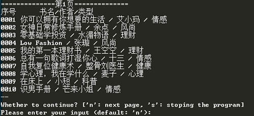
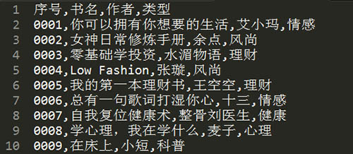

>——问：“如何完成《大卫》这样杰出的作品”
——米开朗基罗答：“很简单，只要用锤子把石头上不像大卫的地方敲掉就可以了！”

采集信息用的程序一般被称为网络爬虫（ Web crawler）、网络铲（ Web scraper，可类比考古用的洛阳铲）、网络蜘蛛（ Web spider），其行为一般是先“爬”到对应的网页上，再把需要的信息“铲”下来。网络数据采集是普通大众细纹乐见的计算机巫术，在信息爆炸的时代，互联网上充斥着大量信息，网络爬虫是获取网络上的信息资源的有效手段。
Python在爬虫编程上有 urllib、BeautifulSoup、 lxml、Scrapy、 PdfMiner、 Requests、 Selenium、 NLTK、 Pillow、 unittest、 PySocks 等模块，对于爱好Python的编程者来说，爬虫必然得学。

<!-- more -->

# 1  用urlopen获取url，用BeautifulSoup读取网页信息

```python
from urllib.request import urlopen
from urllib.error import HTTPError
from bs4 import BeautifulSoup
def getTitle(url):
    try:
        html = urlopen(url)
    except HTTPError as e:
        return None
    try:
        bsObj = BeautifulSoup(html.read(), "lxml")#读取网页，不加"lxml"会有警告
        title = bsObj.body.h1#根据需要选择网页标签内的内容
    except AttributeError as e:
        return None
    return title
title = getTitle("http://www.pythonscraping.com/pages/page1.html")
if title == None:
    print("Title could not be found")
else:
    print(title)
```
# 2  用find/findAll选取特定网页的内容

```python
from urllib.request import urlopen
from bs4 import BeautifulSoup
html = urlopen("http://www.pythonscraping.com/pages/warandpeace.html")
bsObj = BeautifulSoup(html,'lxml')
nameList = bsObj.findAll("span", {"class":"green"})
for name in nameList:
    print(name.get_text())
```
find(tag, arributes, recursive, text, limit, key words)
findall(tag, arributes, recursive, text, keywords)
find()只读取一个，findall()读取所有内容
# 3  Regex正则表达式

`*`：重复任意次，`(|)`：或，`+`：出现多次，且至少1次，`\`：转义
```python
from urllib.request import urlopen
from bs4 import BeautifulSoup
import re
html = urlopen("http://www.pythonscraping.com/pages/page3.html")
bsObj = BeautifulSoup(html,'lxml')
images = bsObj.findAll("img",{"src":re.compile("\.\.\/img\/gifts/img.*\.jpg")})
for image in images:
    print(image["src"])
```
# 4  用urlretrieve下载网络资源

```python
import os
from urllib.request import urlretrieve
from urllib.request import urlopen
from bs4 import BeautifulSoup
downloadDirectory = "downloaded"
baseUrl = "http://pythonscraping.com"
def getAbsoluteURL(baseUrl, source):
    if source.startswith("http://www."):
        url = "http://"+source[11:]
    elif source.startswith("http://"):
        url = source
    elif source.startswith("www."):
        url = source[4:]
        url = "http://"+source
    else:
        url = baseUrl+"/"+source
    if baseUrl not in url:
        return None
    return url
def getDownloadPath(baseUrl, absoluteUrl, downloadDirectory):
    path = absoluteUrl.replace("www.", "")
    path = path.replace(baseUrl, "")
    path = downloadDirectory+path
    directory = os.path.dirname(path)
    if not os.path.exists(directory):
        os.makedirs(directory)
    return path
html = urlopen("http://www.pythonscraping.com")
bsObj = BeautifulSoup(html,'lxml')
downloadList = bsObj.findAll(src=True)
for download in downloadList:
    fileUrl = getAbsoluteURL(baseUrl, download["src"])
    if fileUrl is not None:
        print(fileUrl)
urlretrieve(fileUrl, getDownloadPath(baseUrl, fileUrl, downloadDirectory))
```
# 5  保存成csv文件

```python
import csv
from urllib.request import urlopen
from bs4 import BeautifulSoup
html = urlopen("http://en.wikipedia.org/wiki/Comparison_of_text_editors")
bsObj = BeautifulSoup(html,'lxml')
# 主对比表格是当前页面上的第一个表格
table = bsObj.findAll("table",{"class":"wikitable"})[0]
rows = table.findAll("tr")
csvFile = open("./files/editors.csv", 'wt', newline="", encoding='utf-8')
writer = csv.writer(csvFile)
try:
    for row in rows:
        csvRow = []
        for cell in row.findAll(['td', 'th']):
            csvRow.append(cell.get_text())
        writer.writerow(csvRow)
finally:
    csvFile.close()
```
# 6  读取网络中的word文件

```python
from zipfile import ZipFile
from urllib.request import urlopen
from io import BytesIO
from bs4 import BeautifulSoup
wordFile = urlopen("http://pythonscraping.com/pages/AWordDocument.docx").read()
wordFile = BytesIO(wordFile)
document = ZipFile(wordFile)
xml_content = document.read('word/document.xml')
wordObj = BeautifulSoup(xml_content.decode('utf-8'))
textStrings = wordObj.findAll("w:t")
for textElem in textStrings:
    print(textElem.text)
```
# 7  实战(1)：爬取豆瓣专栏书目，并保存为csv文件

```python
#coding=utf-8
from urllib.request import urlopen
from urllib.error import HTTPError
from bs4 import BeautifulSoup
import time
import pdb
import csv
num = 0  #用来计数，计算爬取的书一共有多少本
start_time = time.time()  #计算爬虫爬取过程时间
#第一页网页网址https://read.douban.com/columns/category/all?sort=hot&start=0
#第二页网页网址https://read.douban.com/columns/category/all?sort=hot&start=10
#第三页网页网址https://read.douban.com/columns/category/all?sort=hot&start=20
#以此类推，0，10，20，30，40，……
url = 'https://read.douban.com/columns/category/all?sort=hot&start='  
csvFile = open("./bookCollect.csv", 'wt', newline="", encoding='utf-8')
writer = csv.writer(csvFile)
writer.writerow(['序号','书名','作者','类型'])
i = 0
#for i in range(0,1000,10):  #这里的  range（初始，结束，间隔）
judgement = 'n'
while(judgement == 'n'): 
    #urllib.request库用来向该网服务器发送请求，请求打开该网址链接
    try:
        html = urlopen('https://read.douban.com/columns/category/all?sort=hot&start=%d' % i)    
    #BeautifulSoup库解析获得的网页，第二个参数一定记住要写上‘lxml’，记住就行
        bsObj = BeautifulSoup(html,'lxml') 
        print('==============' + '第%d页'%(i/10 + 1) + '==============')        
        print('序号','    ','书名/作者/类型')
        contentList = bsObj.findAll('h4')#获取h4标签内的a标签，但这里返回是只含1个元素的list
        contentList = bsObj.find("div",{'class':'bd'}).contents[0]
        for item in contentList:
            num = num + 1
            #pdb.set_trace()
            bookName = item.h4.contents[0].contents[0] #contents将子节点列表输出
            author = item.find("div",{"class","author"}).contents[1].contents[0]
            bookCategory = item.find("div",{"class","category"}).contents[1].replace('\n','')
            try:
                print('%04d'%num, bookName, '/', author, '/', bookCategory)
                writer.writerow(['%04d'%num, bookName, author, bookCategory])
            except Exception as e:
                print('%04d'%num, "book's name not be found")
                writer.writerow(['%04d'%num, "book's name not be found"])            
    except HTTPError as e:
        writer.writerow(['The page can not be opened'])
    #设置抓数据停顿时间为1秒，防止过于频繁访问该网站，被封    
    print("--")
    print("Whether to continue? ['n': next page, 's': stoping the program]")
    keyInput = input("Please enter your input (default: 'n'):")
    if keyInput == '' or keyInput == 'n':
        judgement = 'n'
    else:
        judgement = 's'
    i = i + 10
    time.sleep(0.5) 
csvFile.close()
end_time = time.time()
duration_time = end_time - start_time
print('运行时间共：%.2f'  % duration_time + '秒')
print('共抓到%d本书名'%num, '详细内容见 bookCollect.csv')
```
**运行结果：**

命令框：



bookCollect.csv文件：



# 8  实战(2)：爬取淘女郎图片

```python
import os
import threading
import re
from bs4 import BeautifulSoup
from urllib.request import urlopen
from selenium import webdriver
import socket
from multiprocessing import Pool 
# 由于urllib在获取网络信息经常出现timeout错误，下两行是网友推荐方法，但效果貌似不明显
import requests.packages.urllib3.util.ssl_
requests.packages.urllib3.util.ssl_.DEFAULT_CIPHERS = 'ALL'
# phantomjs浏览器的位置，需要提前安装好，并将路径添加到环境变量
browserPath = 'D:\\desktop\\python\\phantomjs-2.1.1-windows\\bin\\phantomjs'
# 爬虫主页面
homePage = 'https://mm.taobao.com/search_tstar_model.htm?'
outputDir = 'photo/'
# 网页解析器，之前是'html5lib'会出错，改成'lxml'就没事了
parser = 'lxml'

def main():
    driver = webdriver.PhantomJS(executable_path=browserPath)  #浏览器的地址
    driver.get(homePage)  #访问目标网页地址
    bsObj = BeautifulSoup(driver.page_source, parser)  #解析目标网页的 Html 源码
    print("[*]OK GET Page")
    girlsList = driver.find_element_by_id('J_GirlsList').text.split(
        '\n')  #获得主页上所有妹子的姓名、所在城市、身高、体重等信息
    imagesUrl = re.findall('\/\/gtd\.alicdn\.com\/sns_logo.*\.jpg',
                           driver.page_source)  #获取所有妹子的封面图片
    girlsUrl = bsObj.find_all(
        "a",
        {"href": re.compile("\/\/.*\.htm\?(userId=)\d*")})  #解析出妹子的个人主页地址等信息
    # 所有妹子的名字地点
    girlsNL = girlsList[::3]
    # 所有妹子的身高体重
    girlsHW = girlsList[1::3]
    # 所有妹子的个人主页地址
    girlsHURL = [('http:' + i['href']) for i in girlsUrl]
    # 所有妹子的封面图片地址
    girlsPhotoURL = [('https:' + i) for i in imagesUrl]
    # zip函数接受0个或多个序列作为参数，返回一个tuple列表，第n次从各个序列分别取第n个作为tuple
    girlsInfo = zip(girlsNL, girlsHW, girlsHURL, girlsPhotoURL)
    gitlsDeff = []  
    for item in girlsInfo:
        gitlsDeff.append(item) 
    # pool函数来实现多线程，线程数看计算机性能，多线程效率大大提升
    pool = Pool()
    pool.map(downloadimages, gitlsDeff)
    pool.close()
    pool.join()
    driver.close()

def downloadimages(item):
    girlNL = item[0]    #  姓名地址    
    girlHW = item[1]    #  身高体重 
    girlHURL = item[2]  #  个人主页地址 
    girlCover = item[3] #  封面图片   
    print("[*]Girl :", girlNL, girlHW)
    # 为妹子建立文件夹
    mkdir(outputDir + girlNL)
    print("    [*]saving...")
    # 获取妹子封面图片
    data = urlopen(girlCover).read()
    with open(outputDir + girlNL + '/0_cover.jpg', 'wb') as f:
        f.write(data)
    print("    [+]Loading Cover... ")
    # 获取妹子个人主页中的图片
    getImgs(girlHURL, outputDir + girlNL)

def mkdir(path):
    # 判断路径是否存在
    isExists = os.path.exists(path)
    # 判断结果
    if not isExists:
        # 如果不存在则创建目录
        print("    [*]新建了文件夹", path)
        # 创建目录操作函数
        os.makedirs(path)
    else:
        # 如果目录存在则不创建，并提示目录已存在
        print('    [+]文件夹', path, '已创建')

def getImgs(url, path):    
    driver = webdriver.PhantomJS(executable_path=browserPath)    
    # 设置读取时间，防止程序卡住
    socket.setdefaulttimeout(15)
    try:
         driver.get(url)
    except socket.timeout:
        pass
        #send ESCAPE key to browser
    print("    [*]Opening...")
    bsObj = BeautifulSoup(driver.page_source, parser)
    #获得模特个人页面上的艺术照地址
    imgs = bsObj.find_all("img", {"src": re.compile(".*\.jpg")})
    for i, img in enumerate(imgs[1:]):  #不包含与封面图片一样的头像
        try:
            html = urlopen('https:' + img['src'])
            data = html.read()
            fileName = "{}/{}.jpg".format(path, i + 1)
            print("    [+]Loading...", fileName)
            socket.setdefaulttimeout(15)
            try:
                with open(fileName, 'wb') as f:
                    f.write(data)
            except socket.timeout:
                pass
        except Exception:
            print("    [!]Address Error!")
    driver.close()

if __name__ == '__main__':
    if not os.path.exists(outputDir):
        os.makedirs(outputDir)
    main()

```
**运行结果：**
本地photo文件夹：

